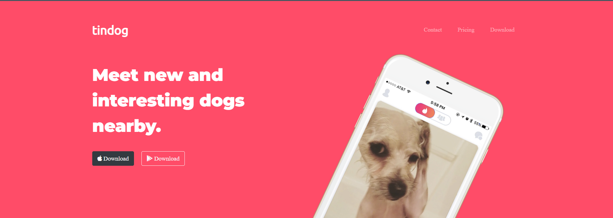
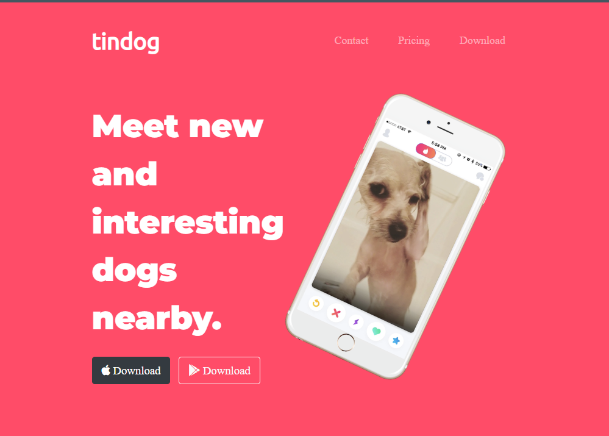
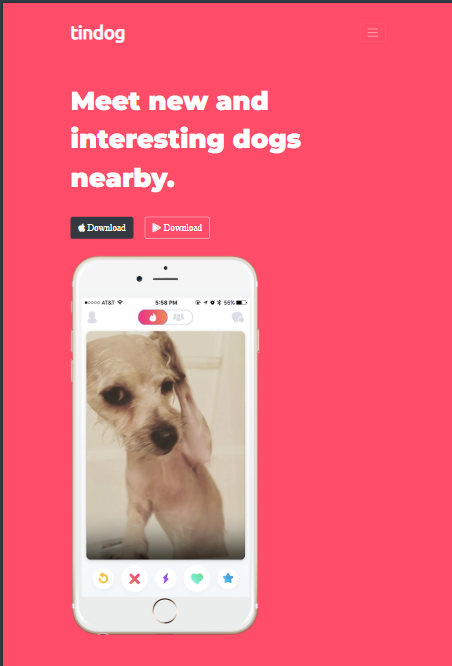

# Tindog - The Ultimate Dating App for Dogs 🐾💖

Tindog is a playful and visually appealing dating app tailored exclusively for dogs. Designed as part of the **Complete Web Development Bootcamp by Angela Yu**, this project showcases creative web design and fundamental frontend development skills.

## 📜 Overview

Tindog allows dog owners to find the perfect match for their furry friends. With a responsive design, adorable layout, and stylish fonts/icons, it aims to bring joy and a hint of humor while honing web development skills.

## 🚀 Features

- **Responsive Design**: Fully responsive layout, ensuring compatibility across desktops, tablets, and smartphones.
- **Stylish Fonts**: Integrates **Google Fonts** for a modern and sleek typography.
- **Eye-Catching Icons**: Utilizes **Font Awesome** to add appealing icons throughout the webpage.
- **Beautiful Aesthetic**: Combines **HTML5** and **CSS3** for a clean, elegant, and fun design.

## 🛠️ Tech Stack

- **HTML5**: Structure of the webpage.
- **CSS3**: Styling, responsiveness, and design layout.
- **Google Fonts**: Ensures modern and user-friendly typography.
- **Font Awesome**: For adding icons to enhance the design.

## 📸 Screenshots

- **LAPTOP**:
  

- **TABLET**:
  

- **PHONE**:
  
  

## 🌐 Live Demo

If you've deployed your project, include the live demo link here:  
[View Tindog Live](#)

## 📂 File Structure

```
tindog/
│
├── index.html       # Main HTML file
├── css/             # Stylesheets
│   └── style.css    # Main CSS file
├── images/          # Images used in the project
└── README.md        # Project README file
```

## ✨ Highlights from the Project

- Experimented with **Flexbox** and **Grid Layouts** for responsive design.
- Used custom Google Fonts to enhance the visual appeal of text.
- Leveraged Font Awesome for professional-grade icons.

## 📚 What I Learned

- Fundamentals of **HTML5** structure and semantics.
- Styling and responsiveness with **CSS3**.
- Adding external resources like **Google Fonts** and **Font Awesome** to elevate the design.
- Building a project from scratch while adhering to best practices.

## 🐾 How to Run the Project

1. Clone the repository:
   ```bash
   git clone https://github.com/ridsb/tindog.git
   ```
2. Navigate to the project folder:
   ```bash
   cd tindog
   ```
3. Open the `index.html` file in your browser to view the app.

## 🎉 Acknowledgments

This project was created as part of **The Complete Web Development Bootcamp** by **Angela Yu**. Special thanks to her for the detailed tutorials and guidance throughout the course.

## 📧 Contact

If you’d like to connect or have feedback about the project, feel free to reach out:

- **Name**: Riddhi Bisht

- **GitHub**: (https://github.com/ridsb)
